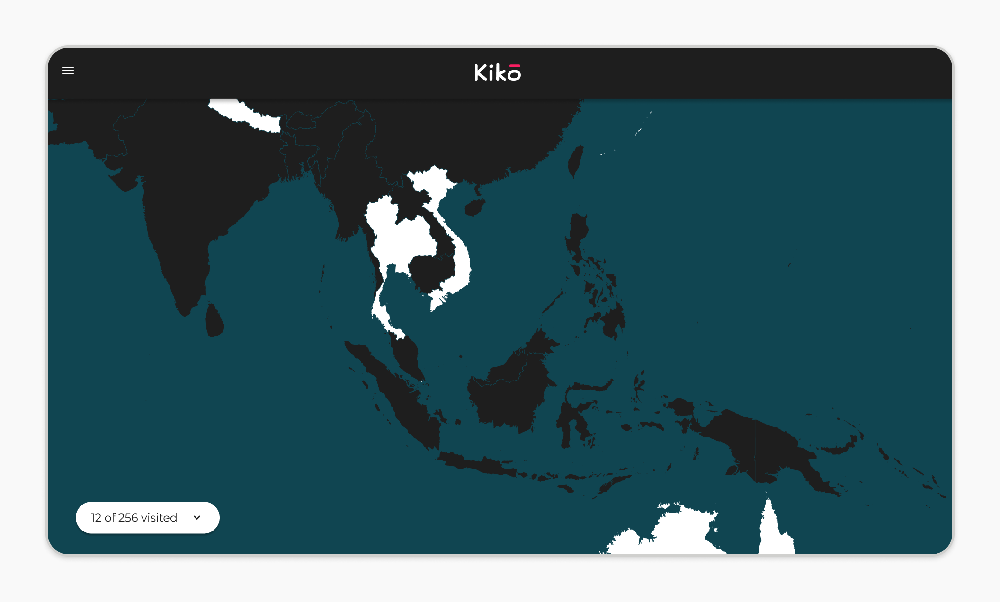
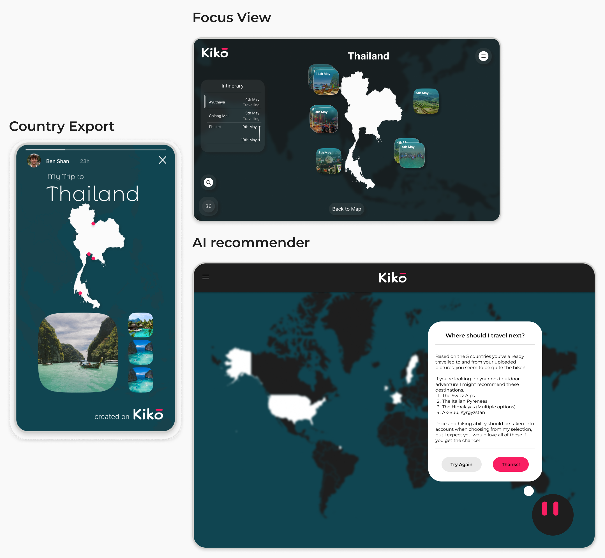

## 🚀 **Inspiration & Objective**

With the revolutionary advancements in AI during 2023 I was inspired to rejuvenate my programming skills, which I haven't used for some years. As I explored the potential of AI chat services, such as ChatGPT 3, as a programming tool, I quickly realised it would be a game changer in the development world, not only for experienced developers but possibly for anyone who was interested. This technology would open the doors to anyone who was interested in creating digital products, regardless of past programming experience. The question was, how wide have these doors been opened and how far could AI carry a novice into the development world? 

I decided to explore this idea more by undertaking a project where I would attempt to use AI to develop a product which I would consider outside my programming abilities in an attempt to answer my chosen Problem Statement:
 

> "How effectively can AI bridge the knowledge gap for designers creating functional digital products?"

 
Given my unique blend of technical understanding and design experience, while not actively programming as a career, I believed I was well-placed to undertake this exploration.

## 🔍 **Project Selection**

When choosing an idea, I decided to go for something I was passionate about and I landed on creating a digital scratch map. Travel has always been a passion of mine. I love to have conversations about favorite destinations and shared experiences with friends and people I meet. I decided that creating an app for travel fans to use while sharing their experiences would be a great product to create and so I chose to make Kiko.

> Kiko, inspired by the Japanese word "Kikō" (旅行記) or "Ryokōki" can be translated to Travel Journal in English.

My idea for Kiko is to be a digital travel journal where users can store their travel history and a place to store precious travel memories.

## 🛠 **Design & Development Challenges**

- **UX**: Although this is predominantly a exploratory AI & Development project, I believe that good UX process is crucial in any project. On starting the project I conducted competitor analysis, created a persona to represent my target user, talked to friends and colleagues about the idea and explored what type of features and interactions would suit such an app.
- **Technology Decisions**: Choosing the right tools and AI platforms was a crucial starting point. I explored serveral options including Bard, Bing Chat and  considered Github Copilot but settled on ChatGPT 4 as the best option for the project and the Problem Statement.
- **Project Scope & MVP**: Identifying what the most basic functions to implement in the app before initial publishment was challenging as it is exciting to ideate potential features! However I refrained and identified key features I needed to implement before initial launch.

## 🎉 **Current Status**

The MVP version of Kiko is nearing completion and will be launched once the final updates have been fixed.
- **MVP Features**: Currently the user is able to log into the app using a Google account, render a personal map for the user to interact with. They can zoom down into small islands and regions and select any country or region that has a unique Alpha3 code (249 countries). They can select a country which changes the colour of it on the map and adds the country's name to the list.
- **Pending Tasking**: Before the initial launch of Kiko, the following tasks need to be completed: Hosting the site and domain acquisition, Finalise account database and fix outstanding bugs (colour change and zoom smoothness). 

## 🔮 **The Path Forward**

Aside from completing the MVP version of Kiko, I have several other plans for the project.
- **Answering the Problem Statement**: This project always had a wider goal than just to create a web app, I also set out to explore the capabilities of AI as a development tool and I have a lot of take aways on the topic while working on the project which can be of value to the design community. I have summarized some of my reflections in the next section, but I aim to write a full report with an answer to my Problem Statement and recommendations for designers looking to develop using AI in the coming months.
- **Continual Development**: I have many many ideas for Kiko and I want to get them into the app to make the user experience even greater! Here are some of my favourite ideas!
    - **Focus View**: Allowing users to click into a country they've added and allow them to add images and notes about their trip to that country.
    - **Country Export**: Offer a 'share' feature which renders a stylized image of a country including personal dates and images from the user's trip that they can share to social media.
    - **AI recommender**: Use the ChatGPT API to offer a 'next best destination' based on past visited locations and on activity preferences (taken from processing of added images and added notes).

## 🤖 **Reflections on AI**

- **The Power of AI in Development**: AI has revolutionized project development, minimizing traditional approaches and extensive documentation dives. With ChatGPT, complex tasks like setting up React and mastering Git are streamlined.
- **Rapid Code Generation**: ChatGPT's forte is its prompt code generation which empowers the user. Yet, the output's caliber often hinges on user prompts, because of this pitfalls and blockers can appear based on the user's technical understanding and ability.
- **The Dataset Dilemma**: ChatGPT, while adept at suggesting tools like D3.js, as it did in during the project, struggled in pinpointing an apt dataset source and in identifying a useful one when presented several in the context of the project's code base. This led to multiple code revisions due to mismatched datasets.This, I believe was due to the following point.
- **Navigating AI's Over-Accommodation**: ChatGPT can have a tendency to be a "Yes Man", trying to accommodate even suboptimal requests rather than questioning the user's understanding. To counter this, I needed to ask for the AI's advice, rather than just give instruction and also to prompt in ways to encourage it to return optimal results, like 'what is the industry standard method for...?'
- **AI for Designers**: AI has now made development so accessible to designers who might have limited or no development experience. Although still restricted to the prompter's knowledge and technical understanding, AI can act as a supersuit, empowering people and expanding their ability to create beyond their personal limitations.

## 🌟 **Conclusion**

AI assisted development is here to stay, there is no denying that. In the summer of 2023 Emad Mostaque, the founder and CEO of Stability AI was quoted to say:

> "Forty-one percent of the code on GitHub is already AI-generated"

That number has only risen in the past months. Although quality of code could be called into question, it is mind blowing to hear that the quantity of code created by the Github community over 15 years since it's creation in 2008 has doubled in less than a year, thanks to the power of AI. This is an incredibly exciting time to be involved in the tech community, AI will allow for more ideas to be tested, production times to be shortened and hopefully for the world to become a better place for everyone as a result! 

I would encourage everyone to begin experimenting with and questioning how to use AI, it has proven to be an incredibly empowering tool and it is only a matter of time before it is common place in most fields. The ever growing elephant in the room now is the question, 'how do we keep it under control?', an incredibly important question and a scary topic when given sufficient thought but for me, that topic if for another project! 

Thank you for reading! 

Kiko images & screenshots taken during project process. Images created using DALL-E3 & Photoshop for this project.

