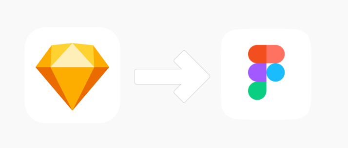
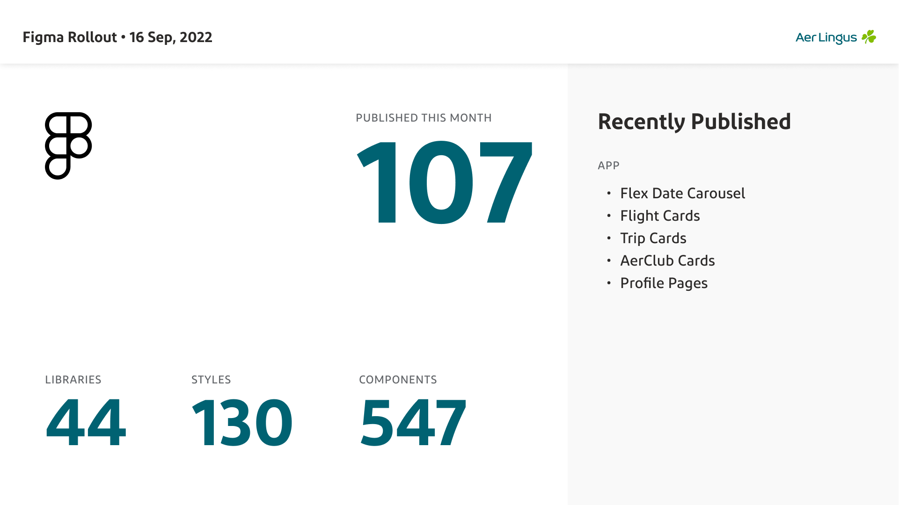
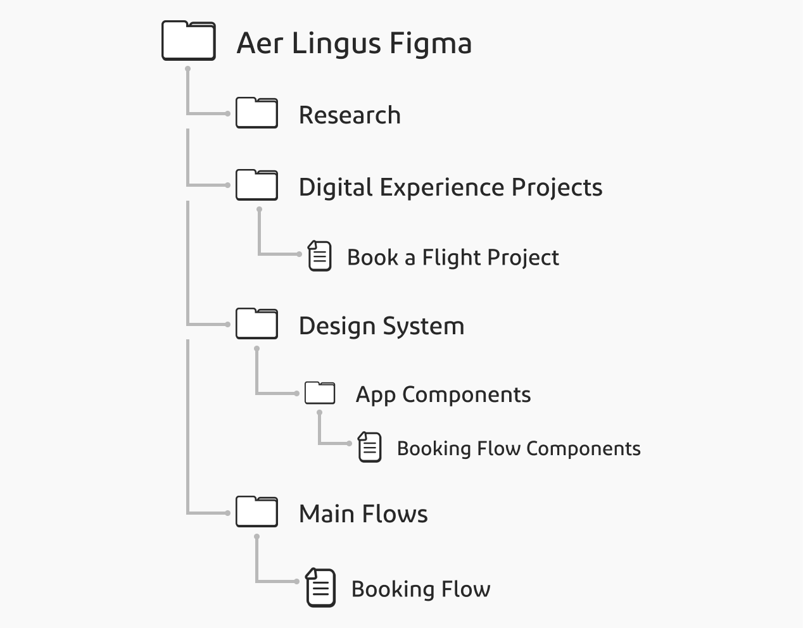
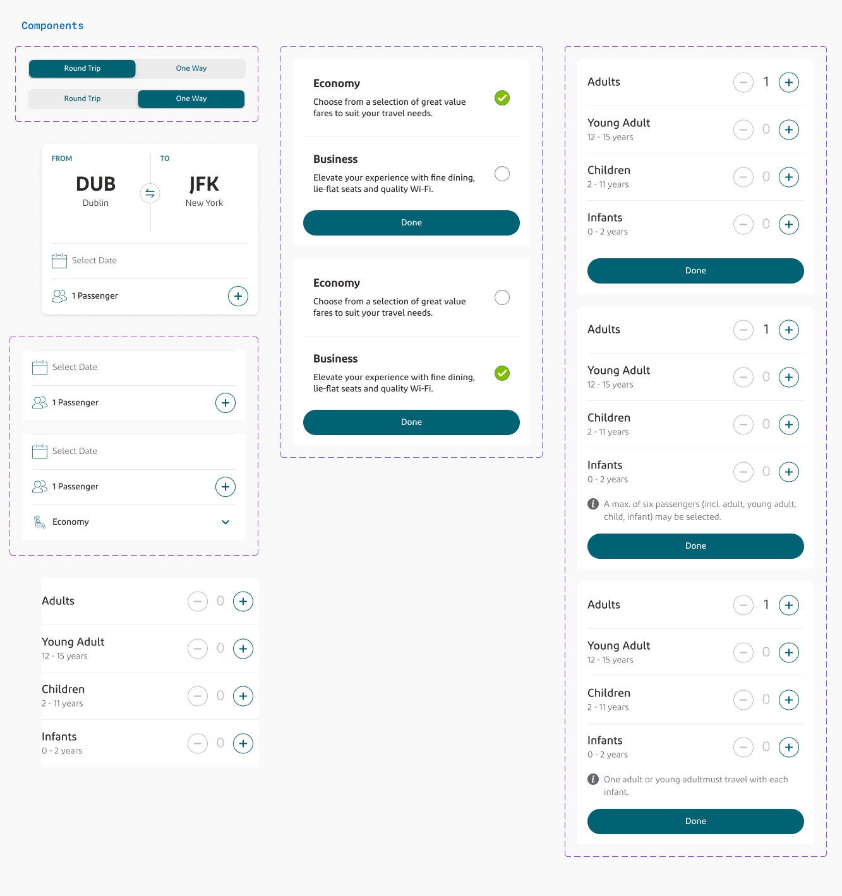
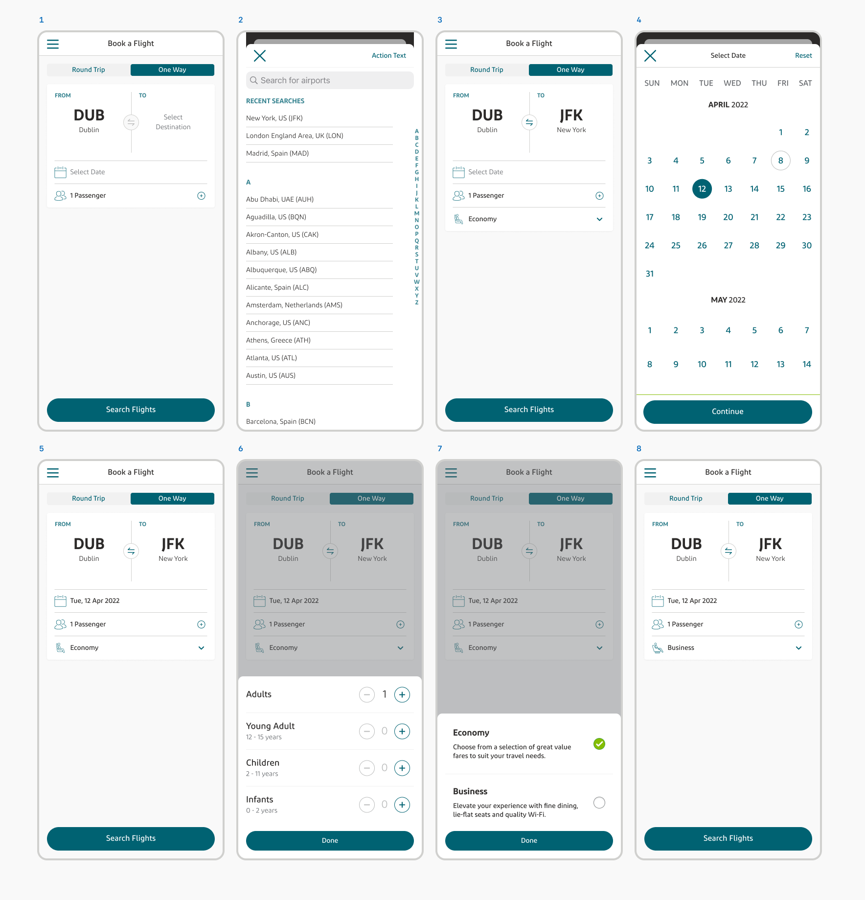
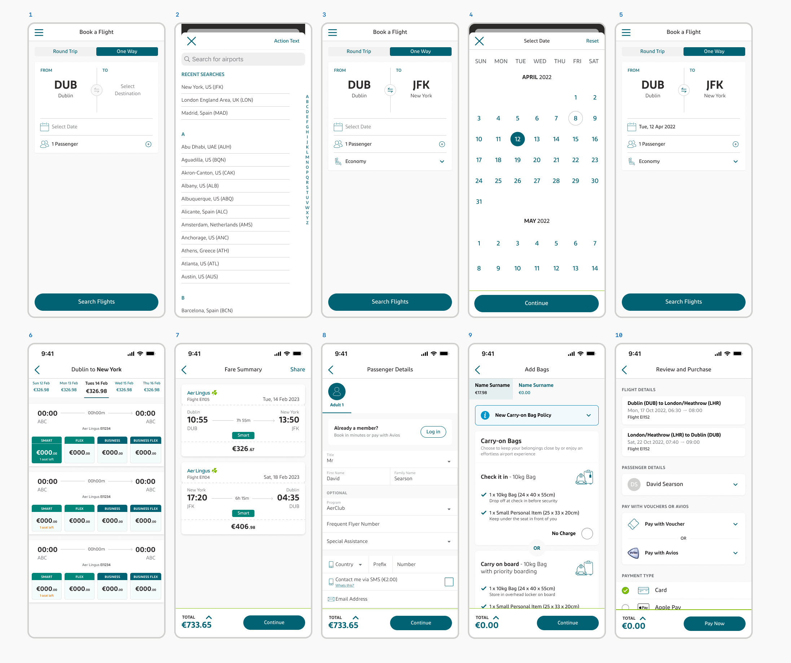

###  **The Opportunity:**

At the beginning of 2022 it was agreed by the Aer Lingus UX design that we would move our UI design application from Sketch to Figma. Since it's release, Figma has continually innovated their tools and features which provides a power service for it's users which I find truly delightful to use. Because of this constant improvement and innovation, Figma has become the industry standard for prototyping according to many in the industry. 

###  **The Challenge:**
However the decision to make the swap wasn't as simple as getting agreement from within the UX and funding for the licence, but crucially also includes the mammoth task of migrating the Aer Lingus design system and all it's components to the new application. It was also deemed important at the offset to ensure we maximized the potential of Figma's features including  Components, Variants, Auto Layout (added later in 2022) and more.

The team was tasked with migrating the design system to Figma, creating a file structure, recreating all live components using Figma and using them to represent the main flows used on the website and app.

A plan and method was set up and over the following month the team began the migration which in the process 44 libraries were created, 130 styles were embedded and 547 components were built. 

###  **Personal Improvements:**
This project was an incredible opportunity to hone my prototype skills further than ever before as, monthly, I was building components from the ground up at a rate closer to how many I might make in a year if not for this system migration. 

Through the duration of the migration, I grew a deep proficiency in Figma and an strong understanding of its extensive capabilities which I used to significantly advance our design system. Because of my capabilities, at the completion of the project I was one of they key contributors to the total prototypes created, second only to the Design System Owner who led the initiative. This experience not only allowed me to contribute meaningfully to the project's success but also to hone a level of expertise in Figma that I'm proud to carry forward in my design practice.

### **A Example: The 'Book a Flight' Project**
To help explain the process clearer and to reveal the nature of the new Figma design system, I will show the process I took to migrate the 'Book a Flight' screen on app which holds significance as I was nearing competition of the redesign of this page when the migration start, as a result only a month or so after completing the designs in Sketch I had to recreate them in Figma, this was also the first project in Aer Lingus moved to development from Figma.

To contextualise the project, the revenue team, when analysing conversion rates, had deemed the drop off rate between the Book a Flight page and the Flight Search Results page too high and a potential opportunity to increase the revenue. I was tasked with the project of redesigning the page to be more appealing, usable and intuitive with the goal of increasing bookings by 1%. Looking at this number out of context looks peculiar however due to the nature of an airline app and many users engaging in the booking flow to 'window shop' or compare fares, the drop off rate is naturally high. Additionally, due to the nature of this industry, such an increase on app was projected to increase yearly profits by over a million euro.

For our design system we decided to structure files in 4 main folders; UX Research, Digital Experience Projects, Design System and Main Flows. Each folder is structured differently internally for the unique needs and quantity of files but for this project, Components would need to be created in the a 'Bookings' file within the 'App Components' folder, in the 'Design System' parent folder. These components then needed to be used to build out all the necessary scenarios for the project in it's own file within the 'Digital Experience Projects' folder structure and lastly, the main screens from the project would then need to be added to the 'Booking Flow' file within the 'Main Flow' folder.

Creation of Components:
As I had already completed the progress of the project; conducting research, ideation, iteration and final design, when it came to creating the Figma prototypes I was able to begin with creating the components.

As I do with all components, I created them at as low as level as the smallest variation was needed, from the I created variants of each component to accommodate all needed variation. It was important to use the established libraries we created for colours, typography etc. so that the components would be automatically updated if the libraries need changing in the future. I also used auto-layout at this level enough to allow for easy scaling.

From here I was able to access these components from the design system and build out all needed scenarios for the project within the project specific file.

Lastly, I took a copy of the main Book a Flight screens from the project specific file and added them to the booking flow.

In closing, the shift from Sketch to Figma was a significant stride for Aer Lingus's UX design, marked by a meticulous transfer of our entire design system and a personal leap in my design proficiency. 

The tangible success of these efforts was evidenced upon initial testing of the implemented design, the conversion rate increased by 5%, which although not indicative of year-long rates, was a huge success for the project. 

