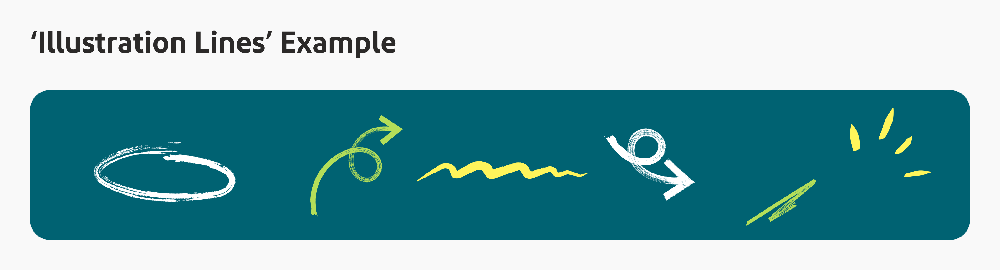
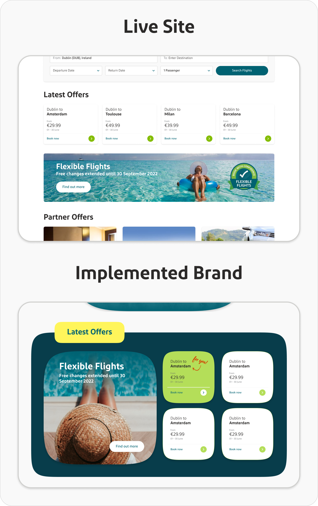
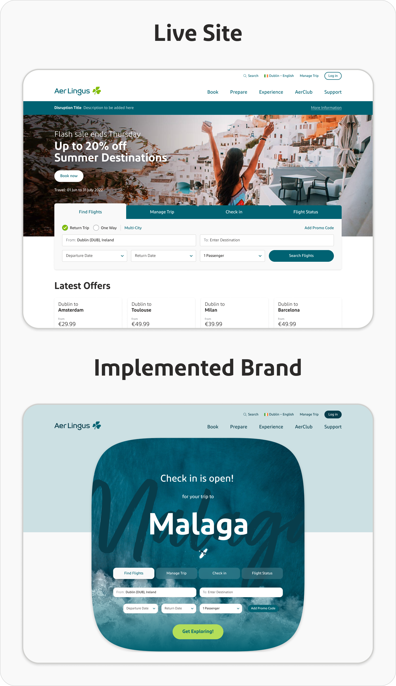

## ✨ **Introduction**

Aer Lingus sought to rejuvenate its identity through a brand redesign. The decision for this change originated from the marketing team who got permission and funded to pursue this goal and source a branding agency to carry out the research and provide recommendations. Innocently, likely to avoid too many opinions from slowing the process, but crucially, the UX team weren't not included in creating the requirements which were set to the agency and I was not aware it was occurring until weeks before we recieved the agency's completed handover documentation.

## ⚠️ **The Branding Handover**

The marketing team received the agency's work after serveral months in production and were eager to share it out and being implementing across the company. However to my dismay on viewing the recommendations, it was obvious that several critical elements for digital implementation seemed to overlooked and it was clear these requirements weren't made explicit to the agency. Key factors which made for implementing these recommendations on live digital products were: 
- **Colour Selection**: New colours appeared unsuitable for digital platforms due to accessibility contrast issues.

- **Font Selection**: The newly chosen font raised concerns about legibility, font sizing longside the existing font and lacked clear licensing guidelines.

- **Design Elements**: Proposed stylised 'doodles' posed challenges for web integration and could lead to design clutter.

## 🚀 **Adapting to the Challenge**

As a team we expressed our concerns regarding the absence of digital specific recommendations, however we were also aware that the wheels were already in motion, the investment had been made and there was a building pressure to implement what had been paid for and prove this a worthwhile endevour. We decided to commence a series of workshops on some of the key pages of the site and attempt to implement some of the design recommendations. We took two approaches to this implementation:
- Hard implementation of new visual recommendations such as colours, fonts and design assets.
- Soft implementation of new 'ethos' recommendations. Creatively visualizing the guidelines to be 'more human', 'less rigid' and 'softer'.

## 🛠️ **Workshop Contributions**

The workshops were conducted efficiently, with a kick off, separate ideation and exploration before coming together again to discuss ideas. From the best ideas were highlighted and brought forward for presented to senior management. Although there was a variation of different ideas from different team members, all touched on that main sections that we we're meant to implement, these sections are listed below along with some of my ideas I created to solve each point:

- **Colour Use**: Using large sections of Dark Navy as a background colour to reduce the amount of white used, recolouring full components with the new colours to assess how much can be used while keeping the site aesthetic and useable, dispursing coloured 'doodles' across the pages to display what can work and many other small changes. 
- **Font Use**: Implemented the new font in creative ways to overcome the potential illegibility of the font by using it alongside the main font or strategically using it for non-crucial content.
- **Softer Edges**: Apart from standard increasing of corner radii, I attempted to try several methods of implementing this ethos. This includes using more visually appealing 'Squircles', I used 'glassmorphia' to soften text overlay sections, introduced largeer image components and overlapped components to break the existing vertical hard lines.
- **Human Touch**: Increased use of photography and choosing of human-centric, natural photos.

These ideas can be seen implemented into existing sections to revamp them with the new recommendations and are compared against their live counterpart:

**Home Page and MyTrip**:
A component-focused redesign ensured seamless user experience and alignment with the new brand essence.

**Latest Offer Section**:
Balancing the new colours and font within a hero squircle was key to maintain user appeal and readability.

**Partner Offer**:
A combination of human-centric photos, soft glassmorphia, and offset headers aimed to resonate with users.

**Booker Bar**:
This vital component received a modern touch with squircles, while maintaining brand consistency.

## 🧭 **Next Steps and Challenges**

As mentioned, following the workshops, we refined some of the best options, implemented them into full page designs and they were used to present to senior management. Although I think we did a very good job manipulating the brand recommendations into function UI designs and did it in an impressive turnaround, there was only so much we, as a UX team, could do at this stage. I fear there are only two options the company can take to remedy this less than ideal situation:

1. Assuming it is within the agency's purview, Aer Lingus could recommission the agency to produce further recommendations for UI specific design, ensuring all requirements are covered. This option will incur a larger cost for the rebrand and will push the timeframe out longer, however I think this is the cleanest, future-proof option.   
2. Alternatively, the company could follow through with the implementation the UX provided, which although was a success given the situation, is ultimately a patch job under poor circumstances. Because of the limitations, the rebrand could only partically be implemented on web, because of this, if the aim of a rebrand was to produce a 'Brand 2.0', the implementation of it on web could only be considered a 'Brand 1.5', making for a slight disparity between digital products and other branded aspects of the company and would likely need another redesign sooner in the future than the first option. The benefit of this option is that it does not require any additional budget and can be turned around in a quick timeframe.

The final decision on this will likely come within the coming months and the next steps being taken immediately after.

## 💡 **Reflections & Takeaways**

While the agency's document was exhaustive and apt for brand strategy to assets, it was tailored more towards print and social, leaving web implementation difficult and messy.

Ethos recommendations, such as increasing the brand's 'human' touch is commendable and beneficial to implement into the digital UIs. It mirrors Aer Lingus's identity and the customers' expectations. Additionally, softening the existing website's somewhat rigid layout is a valuable change to make and during the workshops it was an enjoyable challenge. However, the 'hard' recommends, like colors and font fall short for web use. The site is in need of a refreshing color scheme, but the new proposals were unsatisfactory. The "highlighter" colors, while lively, proved restrictive for web functionality, making the site appear tacky. The hand-written font and 'doodle' design elements, though currently trendy, risk making the brand look dated soon. Many brands, notably in the airline sector, are adopting similar styles, making it less distinctive. I worry that this abrupt visual change to the company's brand, along with out business decisions the company has made in the recent past, particulary around the requirement, which grows more each year, to be able to compete with budget airlines will dampen the incredibly strong positive perception that Aer Lingus has built for itself since it's inception.

While I'm skeptical about the rebranding, I hope I'm proven wrong. Nevertheless, this rebranding exercise offers insights into the complexities of large scale projects involving a wide group of people. I've refined these insights into key takeaways from this project management perspective that I will strive to implement for all future projects:

- **Stakeholder Inclusion**:  Identify affected areas and include relevant members from the beginning. This should be as lean as possible to ensure efficient decision making.
- **Open Communication**: Stakeholders should be updated when changes, milestones and updates occur to avoid surprises at the end.
- **Feedback Loops**: Stakeholders need to be able to raise concerns and suggest changes as the project progresses.
- **Issue Handling**: Mistakes should be caught early and fixed appropriately.
- **Value Existing Loyalty**: Do not take positive customer perception for granted, no matter how long you’ve had it for. It needs to be continually ‘re-earned’ with every decision that might affect it.
- **Review & Assess**: When an end result has been delivered, be it from within the company or from an external team, stakeholders must review and assess all requirements have been fulfilled to a satisfactory degree. Large scale projects can detrimentally affect company morale if groups feel unheard or their work appears undervalued.

## 🎬 **Conclusion**

Ultimately, this project was a valuable opportunity to design for the future, not being tethered by many restrictions but allowed to envision what is best for the companies image with some of my ideas and solutions helping Aer Lingus navigate into, what I hope is, a bright future. Additionally, this project gave me a unique insight into a near company-wide project, introduced me to some of the complexities that such a project involves and allowed me to take some valuable insights from it.

Designs are some of my contributions during the rebranding work. Images created using DALL-E3 & Photoshop for this project..

