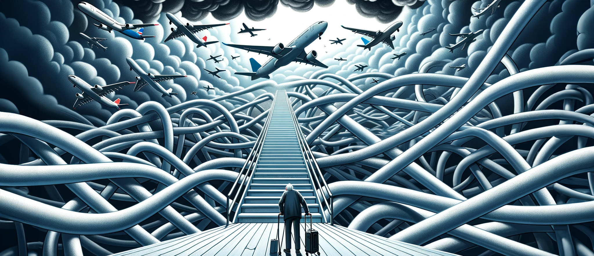
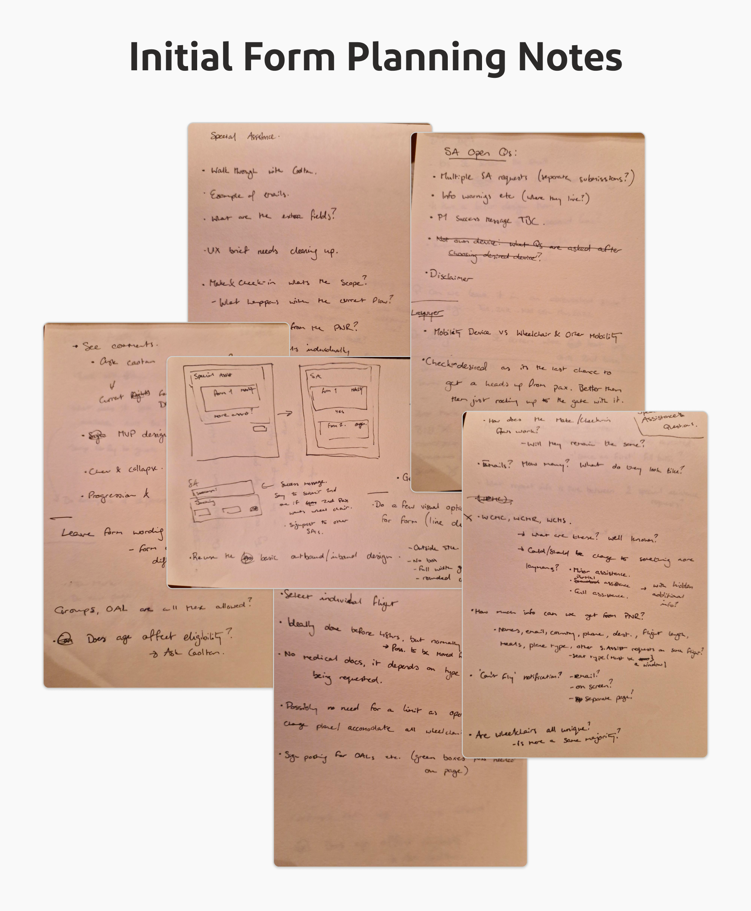
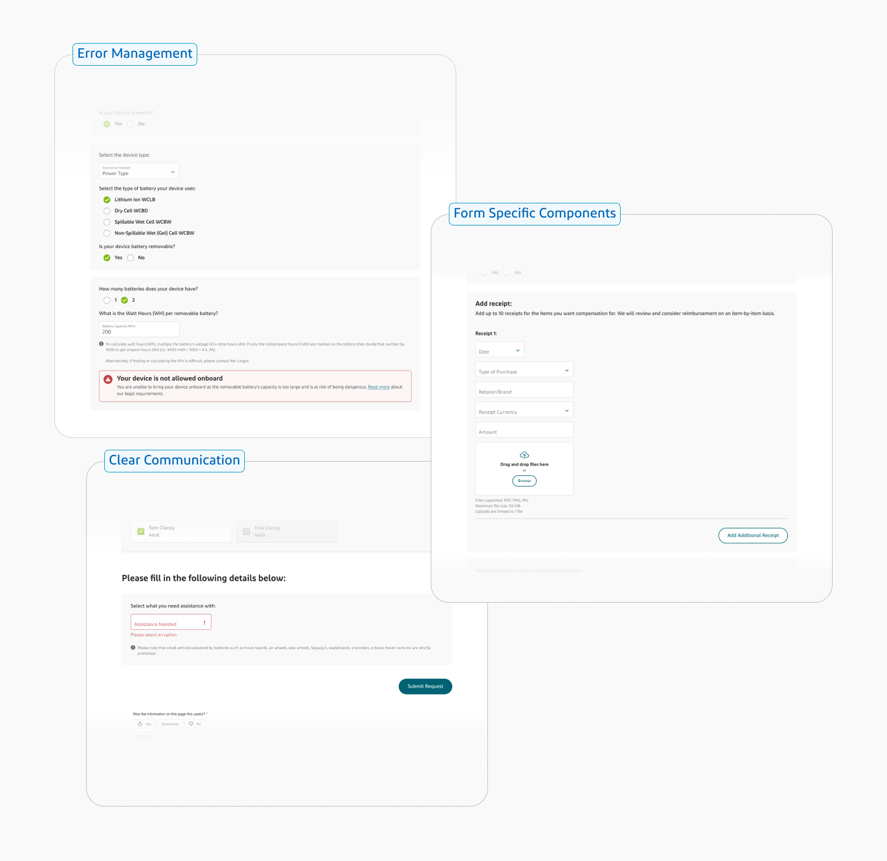

### 🚀 **The Challenge:**
Every month, Aer Lingus handles thousands of form requests, including everything from special assistance and special meals to refunds and missing bag retrival, essential requests for many passengers to be able to fly and others where the reputation of the company rests on the response received.

Prior to this work, the process to a request required customer service manually handling each request which could take serveral days and would sometimes require a follow up phone call to gather additional information. This process left the user uncertain and anxious and was incredibly inefficient and costly for the customer service team.

### 🔍 **Pinpointing the Issues:**
- **Delayed Clarity for Passengers:** Users remained uncertain about their request status for an undefined period.
- **Reliance on Calls:** Many modern users want to avoid phone communication and expect to be able to handle their issues online. All users would rather complete a request in one action, not a two part information gathering process.
- **Company Strain:** This process was highly cost inefficient and time consuming for the customer service team.

### 💡 **The Solution: A Suite of Comprehensive Request Forms**
The decided solution was to recreate the existing forms to make them more user friendly and as automated as possible so that users would know upon submission whether their request would be approved or not. Additionally, we aimed to merge as many of the existing forms as possible to reduce the overall number of forms. Significant work was also carried out on the signposting to the forms on the site to ensure users could find the correct form easily. 

The main solution goals I defined for the project were:
- **Dynamic and Progressive:** Using various design techniques to present only relevant questions and information to the user when they need it.
- **Efficient and Informative:** Immediate feedback on the request's approval status or reasons for rejection.
- **User-Centered Design:** Balancing the design for both typical use cases and unique scenarios.

### 🛠 **Design Choices and Innovations:**
Each form required its own unique design to address the specific requirements of the request. Additionally, the design considered the user's expectations and the mindset they bring when approaching the form. Delving into the nuances of each form would be extensive. However, the design methodology adopted for each form remained consistent. 

The main design hallmarks applied to each form were:
- **Progressive Disclosure:** Questions are revealed efficiently as the user progresses. This approach prevents the user from being overwhelmed by concealing the form's full extent, which can encompass up to 25 questions.
- **Input Selection:** The design emphasizes the selection of optimal input types for varied information. Additionally, the order of fields was structured intuitively for user ease.
- **Error Management:** Intuitive and informative error messages were implemented. This ensures that users understand what information is needed, can easily identify their mistakes, can recognize why any issues occurring during the process have happened and, importantly, know when their request has been successfully submitted.
- **Unique Components:** While many standard fields had previously been designed for our design system, this project necessitated the design of several new components to accommodate specific information requirements.
- **Clear Communication:** Clarity in data requirements was paramount. Each question and message, both positive and negative, were meticulously worded to guarantee clear understanding. At the same time, brevity was maintained to prevent information overload.

### 🎉 **Triumphant Outcomes:**
Although the development of these forms is still ongoing, the design phase has concluded, and I continue to provide support to our developers. Despite being in progress, the positive impacts of this work are already evident. For instance, with the Special Assistance Form—our most extensive form and the first to undergo development—the following results have emerged:
- **Timely Execution:** The MVP for the main form, from initial requirements gathering through design, development, and deployment, was finalized in a mere 4 months.
- **Cost Efficiency:** Despite an initial projected development cost of hundreds of thosands, subsequent monthly savings are, and continue to be, significant.
- **Call Reduction:** True to the project's objectives, we've observed a remarkable decline in calls—over 1000 fewer to the call center each month. This reduction translates to thousands of euros saved for the company monthly.
- **External Validation:** On a design-specific note, the live Special Assistance form underwent an external UX audit, which it comfortably passed, receiving commendable scores and feedback.

### 🤝 **Stakeholder & Project Management:**
With the size of this project to brought multifaceted demands beyond design, I became an indispensable asset for the team, not just in design but in realms that required a deeper understanding of business, legal, and technical aspects. Due to the size and urgency of this project, the business side of the team we overwhelmed allowing for an opportunity for me to prop up the project management in the following ways:

- **Depth of Knowledge:** I routinely engaged in in-depth discussions about business rules for each form, helping to uncover previously overlooked limitations and requirements. This proactive approach made me a trusted reference point for product owners and developers regarding design decisions, business considerations, and legal ramifications.

- **Technical Adaptability:** Venturing into areas beyond my typical scope, I grew a general grasp of the developer's workings and their implementation of third party APIs used in our forms. This not only bolstered the design aspect but also provided the team with foresight into potential technical limitations, ensuring a more holistic development approach.

- **Proactive Communication:** Recognizing the importance of staying updated, I maintained open channels of communication with key stakeholders. Whether it was the project manager, UX researcher, product owner, or developers, my involvement in meetings and discussions ensured I was always informed, allowing me to make well-rounded decisions and provide valuable feedback while also acting as a holistic knowledge source for others.

These endeavors not only strengthened the project's foundation but also fortified my relationships within the team, emphasizing the importance of a UX designer's role in modern project management.

### 🔮 **Moving Forward:**
Our recently developed forms are set to significantly enhance the passenger experience. Be it some forms aiming to reduce anxiety for travelers looking for support or other forms working to expedite and simplify the process for users seeking information or reimbursements. 

Together, these enhancements not only streamline user interactions but also optimize our call center's efficiency, forecasting substantial annual savings. As final development is still in process, we eagerly anticipate the transformative results these tools will bring—both for our valued customers and overall costs of providing this essential service. 

The early success from these forms hints at the profound positive impact we expect from our complete suite of form designs. The future, with improved customer interactions, looks incredibly promising.
