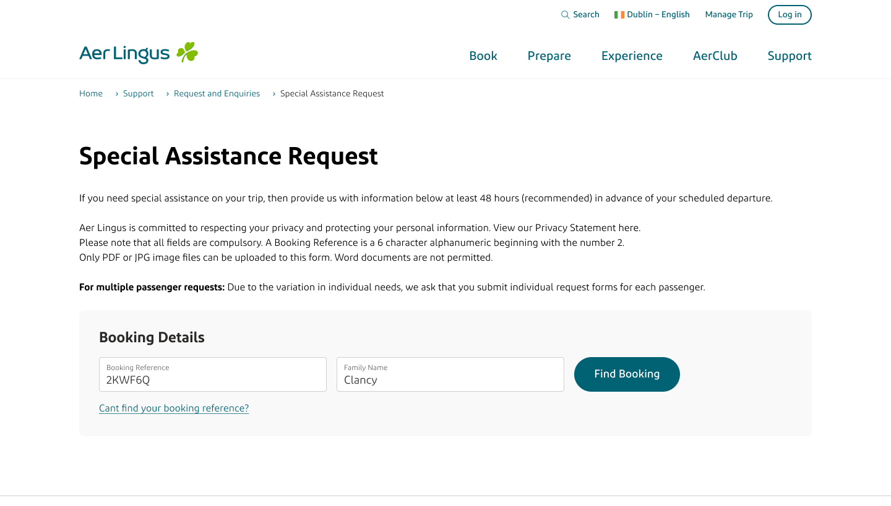
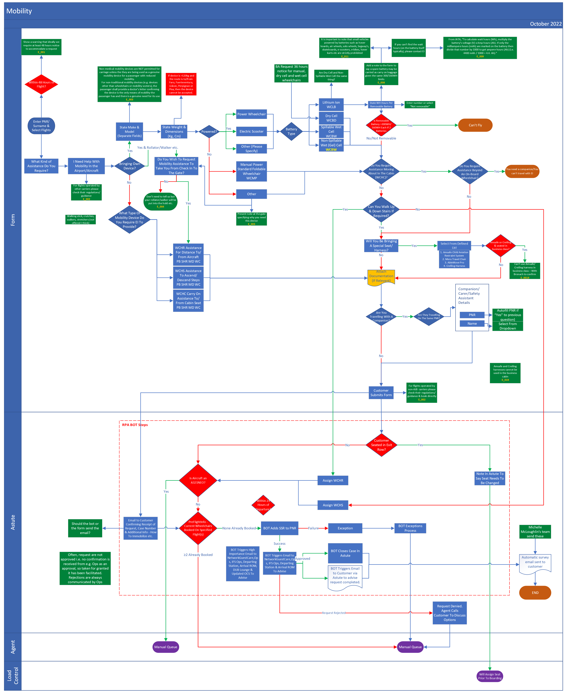
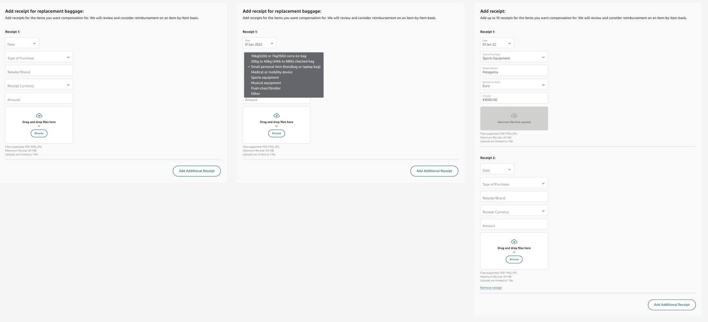
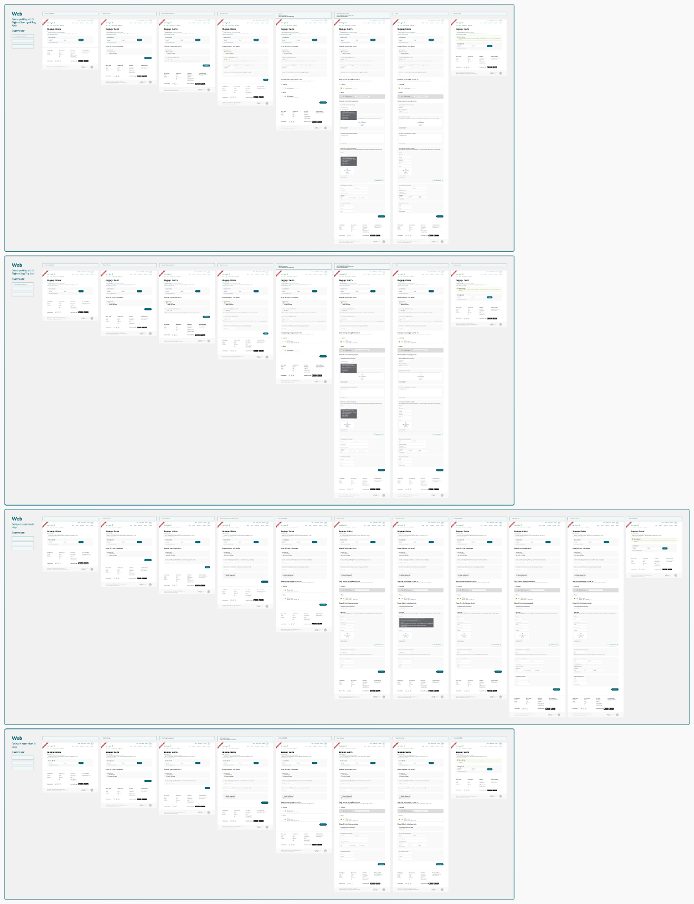
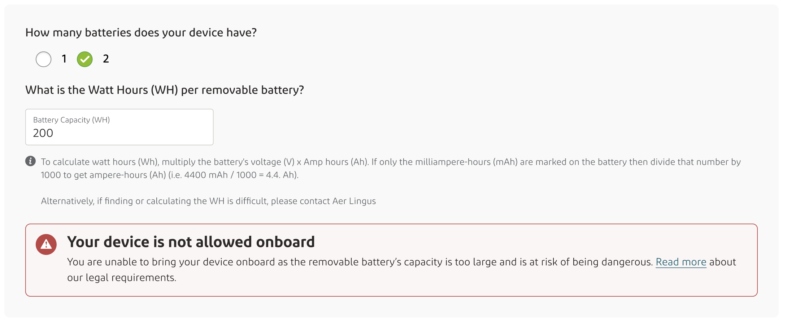
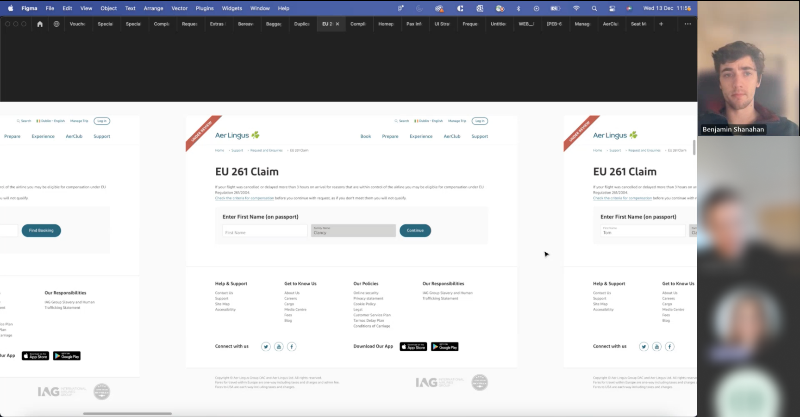
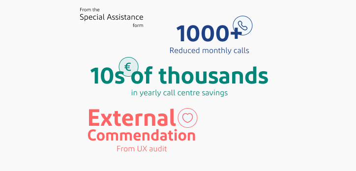

## Project Premise & Objectives

- **Challenge:** Every month, Aer Lingus received thousands of requests covering a wide array of topics including refunds, assistance, missing luggage, and more.
- **Legacy System Issues:** The previous system required manual handling of each request by customer service, leading to delays and inefficiency, costing the company significantly.
- **Objective:** Develop a suite of intelligent forms to handle all passenger requests, automating the process as much as possible for quick, if not immediate, responses.

## Role

- **Position:** Product Designer
- **Responsibilities:** 
  - Leading interface and interaction design of all forms.
  - Collaborating with UX Researchers, Product Managers, Business Analysts, Product Owners, Developers, and Stakeholders.
  - Extensive stakeholder management, information gathering, and some research.
  - Becoming a source of truth for requirements and status updates due to the project's complexity and scale.

## Timeline

- **Duration:** 1 year
- **Process:** 
  - Tackling one form at a time through a scoped process:
        1. Kick Off & Initial Planning
        2. UX Research
        3. Requirements Gathering
        4. Iterative Design
        5. Shareout
        6. Hand off to Developers
        7. Support Developers

## Project Challenges

- Creating various complex forms.
- In-depth information gathering and retention.
- Bespoke design for each form based on unique requirements.
- Managing a large number of stakeholders, often unique to each form.
- Representing the UX team as a principal.
- Sharing the responsibility of overall project management.

## Process

- **Approach:** Consistent process for each form, scaled according to the form’s needs.
- **Total Forms:** 14

### Example - Special Assistance Form:

#### UX Brief Agreement:
- As with every form project and all projects I carry out, I defined the scope of the work required and agreed the with the Product Manager and other stakeholders. This includes timelines, inscope features and more.

#### UX Plan:
- From the UX Brief, while working with the UX Researcher, we formed a UX Plan detailing the required steps and tasks we needed to follow in order to achieve the agreed UX Brief goals. These steps are broken into UX Research and UX Design, my responsibility was to assist in aspects of the Research and complete the Design segment. The steps detailed in the UX Plan align to the bullet points in the sections below.

#### UX Research:
- My contribution to Research:
    - Discussions with Experts & Stakeholders
    - Form design best practices
    - Defining Scenarios
- Additional Research conducted:
    - Traffic and feedback analysis from current forms
    - Identification of touchpoints, navigation, and signposting

#### Ideation & Design:
**Research Review:**
- Once the research had been completed, I began reviewing it, ensuring that once I began ideation I would have a solid understanding of the context I was building for.

**Prototyping and Iteration:**
- I began my ideation stage by creating and adapting components to cover all required scenarios for the defined goals, for some field this was simple, however for more complex information gather fields which needed to handle outlier scenarios and unique situations, this was more complex, for example, although not used in the Special Assistance form, the 'Add receipt component' was challenging to create, ensuring it gathered the required information from the user, making it intuitive and easy for the user to add the details while also allowing for users to add several receipts without hinder those who didn't need that.

**Scenario Flows Creation:**
- Once I have create the components, I began constructing all the scenario flows that we had defined in our research phase. A large aspect of this was designing how the form would reveal itself and in what order the questions needed to be presented. The form needed to reveal itself in a way that it wouldn't overwhelm the user while tasking the user with enough so that it didn't feel any more tedious than it needed to be. It was also crutial to architect the forms so that it would ask the user the relevant questions to their scenarios, not asking redundant questions and not missing any relevant ones.
- A flow was required for every possible scenario and due to the complexity and 'self-service' nature of the goal that was set, this meant there were several flows for each form.

**Error & Recovery Scenario Definition:**
- Once the flows were created, reviewed and refined, I began covering all error states that the form required and ensuring a way out for the user in that scenario to make sure that, even when the form couldn't solve the user's issue it would always point the user to a possible remedy.
- For this stage I worked closely with copy writers to ensure the messaging accurately displayed to sentiment and information needed in an efficient way.

**Stakeholder Reviews & Refinement:**
- Continual stakeholder check-ins throughout the process was a crucial part when designing the forms. At each stage, be it component design or flow layouts, I regularly looked for feedback and input put from relevant stakeholders to ensure I was continually aligned with the set plan and was making progress to the end goal.
- Stakeholder reviews were also crucial at the completion of each form. Once I had created all flows, error states and unique scenarios I would organise a large shareout, or several smaller shareouts, with relevant stakeholders. This would include, product managers, business analysts, developers, product owners, the head of UX and sometimes operations or legal representatives. These shareouts, although sometimes challenging were invaluable to the process. I don't think there was a single end-shareout that did not result in discussions and changes to the process or end designs. Often a humbling experience, these shareouts continually reminded me of the value of colaboration and input from other experts and the value that their diversity of their experiences could contribute to their end product.

#### Deliver & Report:
**Tech Solution Explanation & Handover:**
- Once agreement had been reached between the key stakeholders that the goal agreed at the beginning of the project were achieved I conducted additional shareouts with the developers who would be creating the live product. During these shareouts I would explain the solution and specific interactions and answer any questions they had about the solution.
- Although sometimes additional iterations of the design would need to be conducted to alter the designs due to technical limitations, these occurances were rare as I would continually make a strong effort to involve representatives from the development teams early on in the process.

**Developer Support During Development:**
- Once the solution was handed off, the developers would begin their process. During this time I would often need to take calls and answer emails regarding specifics for of the design as it was being developed. Additionally as sections were completed I joined demos of the finished product and shared feedback and encouragement regarding the work that was completed.

## Results

**Successfully completed forms**
- The project has successfully concluded the design phase for all 14 forms with all detailed flows and scenarios which were required handed off to development. Although my design stage is completed I continue to support the developers during the development process and will continue to do so until all forms are live.

**Reduced call volume**
- A key achievement is the significant reduction in call volume, particularly evident with the Special Assistance Form. This form, being the most extensive and the first in development, has contributed to over 1000 fewer calls to the call center each month. This call reduction will significantly increase when all forms are live.

**Significant cost savings**
- The project has been cost-efficient, with savings far exceeding initial projections. This efficiency is highlighted by the Special Assistance Form, where despite high development costs, the monthly savings have been substantial. Once the entire suite of forms is live, they are on track to save the company on average 1 million euro every year.

**Comprehensive UX Audit**
- The Special Assistance Form underwent an external UX audit and passed comfortably, receiving positive scores and feedback. This validates the design and functionality of the form.

