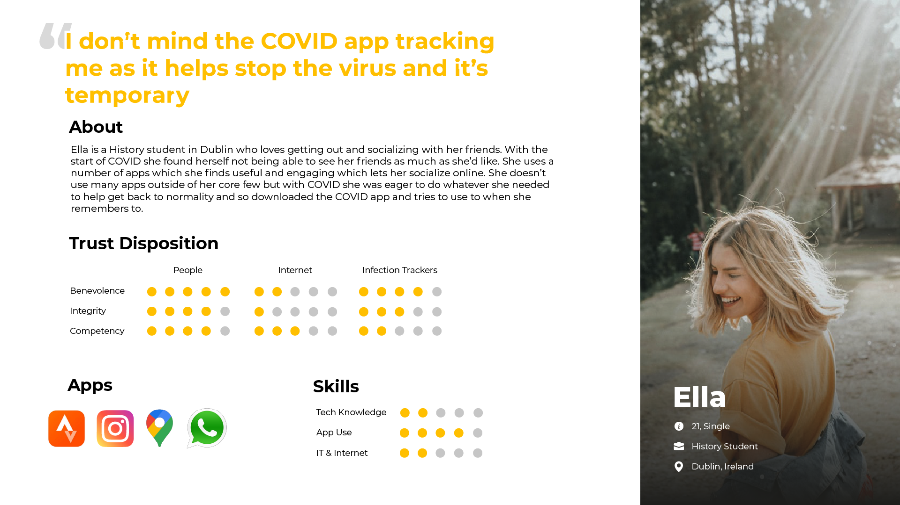
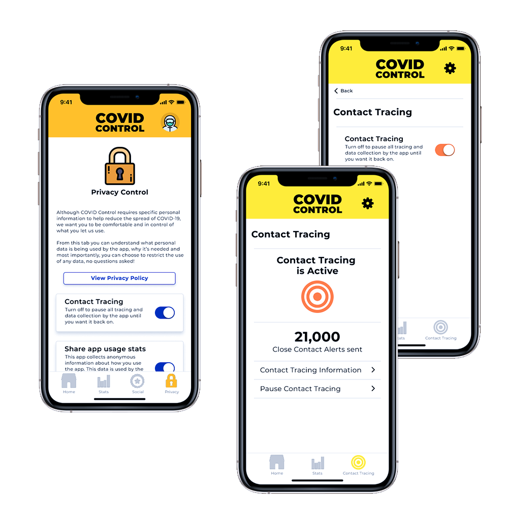

## Project Description

The final project of the Masters requires the primary and secondary research of a selected problem statement followed by developing a digital solution for the stated problem. My chosen research question for this project is:

**What is the impact of trust focused design on a user’s trust, usability, satisfaction and intent to use when using a contact tracing app?**

While attempting to answer this research questions I conducted secondary research of trust design, usability design, satisfaction design, intent to use and COVID-19 infection trackers as well as primary research of the public's disposition to trust and their use and perception of COVID-19 infection trackers. With the results of the research, 7 Trust Focused Design Principles were established which will later be used to create prototypes of a trust focused COVID-19 infection tracker which will be tested against an prototype app which doesn't contain the trust principles. These tests on the prototypes will be used to answer the research question.

## Focus Area
User Research, Literature Research, User Experience Design

## Research

The first stage of the project was an extensive literature review of all relevant areas that would relate to the research question. From this research a strong understanding of the literature surrounding the chosen topic was attained along with the further refining of the problem to be solved.

During this literature review the following areas were covered: COVID-19 contact tracing apps, Trust in COVID-19 contact tracing apps, Health apps, GPS Tracking, Interpersonal Trust, Digital Trust, Measuring Trust, Designing for Trust, Usability, Satisfaction and Intent to Use. Along with understanding the listed topics, a series of models and scales for use when designing in each of the respective areas were highlighted and assessed for use in the project.

Some main takeaways from this stage of the project included confirmation of prevalent issue of a lack of trust in COVID-19 contact tracing apps, an understanding of how trust is implemented in user experience design and the identification of specific scales to be used to measure trust, usability, satisfaction and intent to use during the primary research and testing sections of the project.

## Methodology

The methodology of the project, seen in the image below, will be carried out in three phases.

Firstly, the Empathize & Define section which involves understanding the user base, general public opinion regarding COVID-19 trackers, public trust habits and finishing by creating artifacts to represent the findings. This was achieved by conducting a public survey, a competitor analysis of COVID-19 trackers and general tracker apps (e.g. exercise apps), conducting user observations and interviews and, lastly, creating user personas and user stories. As well as these artifacts, Trust Focused Design Principles were created to be followed for designing in difficult to trust scenarios.

Secondly, the Ideate & Prototype phase involves the development of two prototypes, one incorporating the Trust Focused Design Principles and one that doesn't. These 2 prototypes will be iteratively designed and testing resulting in 2 final prototypes which will be used in the final assessment.

The final stage of the project, the Test & Assess phase, where the final prototypes from the second phase are tested, firstly, through a Quantitative online test and followed by a Qualitative A/B between-subject test. For both of these tests participants we be asked to complete a series of tasks using the prototype provided, on completion they will be asked to participant in a post-test assessment in which their trust in, perceived satisfaction, perceived usability and intent to use with regard to the prototype used will be measured. Finally these results will be used to answer the main project research question.

## Initial Results

To date, the public survey and qualitative observations and interviews have been conducted with the results being used to define the specific user base.

The survey had 65 participants reached through public forums, social media and personal connections. The participants were asked questions to assess their technology use, technical literacy, tracking app usage, disposition to trust and opinion of current COVID-19 contact tracing apps.

Some key findings are displayed below and include a high level of technical use, a generally trusting view of technology and the internet followed by a neutral/nearing distrustful view of COVID-19 contact tracing technology.

After the survey, 5 Qualitative observations and interviews were conducted where participants were chosen to represent the demographics of the survey, with a main focus being on technical literacy. The participants were asked to complete a series of tasks using the Irish COVID tracker app as well as asked a series of questions to assess their app usage, specific preferences and levels of trust towards tracker apps, their disposition to trust, structural assurance, COVID tracing app trust beliefs, COVID tracing app trusting intentions, probability of dependency and perceived quality of the tracing app.

For all the participants there was an acknowledgement of general distrust of tracking apps with functionality, convenience and a sense of control being the key factors which cause them to overcome their sense of distrust. In relation to the Irish COVID app some key findings are that all participants said they found the app trustworthy, however one participant also stated:

> ‘I trust the intentions of the people behind the app, but good intentions don’t always mean good results. I don’t have much trust in the technical capability of the app’

Using the results of the primary user research, personas and user stories were developed to encapsulate to main groups within the user base, those with high technical literacy, which often correlated with a higher level of suspicion towards tracking apps and those with a lower technical literacy which was often accompanied with a higher level of trust towards people and technology.

## Trust Focused Design Principles

One of the main products of the project are the creation of the Trust Focused Design Principles which are guidelines to developing technology for use in difficult to trust situations, such as within the context of infection trackers, but could be used within similar circumstances.

Multiple main factors which arose during the primary research which contribute to an increase or decrease in trust within in the context of tracking apps, particularly COVID-19 contact tracing apps, were identified and used to construct the following 7 principles:

- Accessible Privacy Policy
- Explain Yourself
- Affirm Usefulness
- Engage your Audience
- Ensure Control
- Look Professional
- Easy to Use

## Prototyping

It was decided that Prototype B would be designed to emulate current COVID contract tracing apps, excluding any features that may adhere to the first 5 Trust Principles. For Prototype A, features were ideated that would help adhere to the 5 Trust Focused Design Principles. The paper prototyping stage of this project was focused on defining what features would fulfill the principles through iterative design and testing. Below are the first 5 Trust Principles, what feature was chosen to fulfill them and the initial design for that respective feature.

The images below detail the wireframes of some key screens for each prototype. The first image is of Prototype B which detail key commonality to the current Irish COVID tracker app while the second image is of Prototype A which has updated screens aligning to 7 Trust Focused Design Principles.

Once completing initial paper prototypes, designs were coverted to navigable versions using Marvel (marvelapp.com). Using this appparticipants were recruited to complete tasks taking them through all pages. Key findings from this include one participant stating a critique of the privacy policy button:
‍
>‘I would’ve assumed the policy button was an external link and I wouldn’t bother checking it’
‍
Another useful comment from the second pariticpant was a comparision to the gamification and competition factors of Duolingo:

>‘I think some people might use the badge feature, but I wouldn’t. Its similar on Duolingo, I know some people like the badges, but I don’t bother. The leaderboard progress helps me to keep doing it’

After defining the main structure and design choices of the two prototypes, digital prototypes were created using Figma (www.figma.com).Below are some of the key pages of both prototypes, detailing the differences with explainations of some of the design choices.

In order to achieve all the principles, particularly 'Engage Your Audience' and 'Explain Yourself' novel features were introduced including a Social feature as well as an Onboarding experience, as seen below:

## Testing

Testing of prototypes was done in two stages. Firstly, a quantitative A/B between-subject testing of the two prototypes where participants carried out a series of tasks with one of the prototypes and completed a survey based their experience with the prototype. The second stage of testing was a qualitative within-subject testing of both prototypes where participants were asked to complete a series of tasks with prototype A, answer questions on their experience, complete similar tasks with prototype B and answer the similar questions based on that experience.

Participants for the quantitative test were recruited through online forums, social media, friends, and family, half of the participants used prototype A and half using prototype B. Prototype test was conducted using Maze and linked to the survey conducted using Microsoft Forums.

Participants from the exploratory research phase who accessed to be part of further testing were recruited for the qualitative tests. Participants were asked to use the Figma prototype walkthrough to complete the tasks, user observations were carried out as the participants completed the tasks and, on competition, user interviews were conducted assessing their experience with both prototypes.

## Results

From the first stage of testing, 45 participants completed the questionnaire, 21 of which had used Prototype A and 24 using Prototype B. 20 participants identified as female with 25 identifying as male, the age range of participants was 18- 65 with over half being in the range of 25-34 years old.

All results gathered as part of the survey were done through 7-point Likert scales except for the System Usability Scale which was done through a 5-point Likert scale.

The results of the Satisfaction, Usability, and Intent to Use scales and two Trust sub scales which directly assessed the participant’s opinions of the prototype were statistically assessed to measure the results’ reliability, normality, and significance.
A Cronbach’s alpha reliability test was run on the scale results to test their reliability. All results had a Cronbach’s alpha higher than 0.70 meaning all data could be deemed reliable. The Prototype A results were significantly higher than those of Prototype B. Satisfaction was the only metric which was not statistically significant.

## Conclusion

This paper details the development and evaluation of 7 Trust Focused Design Principles which aimed to increase a user’s trust, usability, satisfaction, and intent to use of an application within a Difficult to Trust scenario. During the study, the principles were developed based on literature and primary research, implemented into prototype A, a contact tracing app and compared against prototype B, a contact tracing app without the principles, and tested using both quantitative and qualitative techniques. The results of these tests were gathered using a series of proven scales for separately assessing trust, usability, satisfaction, and intent to use. The study had a main research question of ‘What is the impact of Trust Focused Design Principles when using a contact tracing app?’ and four null hypotheses for each of the variables being measured. The results of the study were that the null hypotheses for trust, usability and intent to use were rejected, showing that the Trust Principles did have a significant impact on the level of trust, usability and intent to use the app compared to an app without the principles while the satisfaction null hypothesis was retained showing the principles did not have a significant impact compared to an app without the principles.